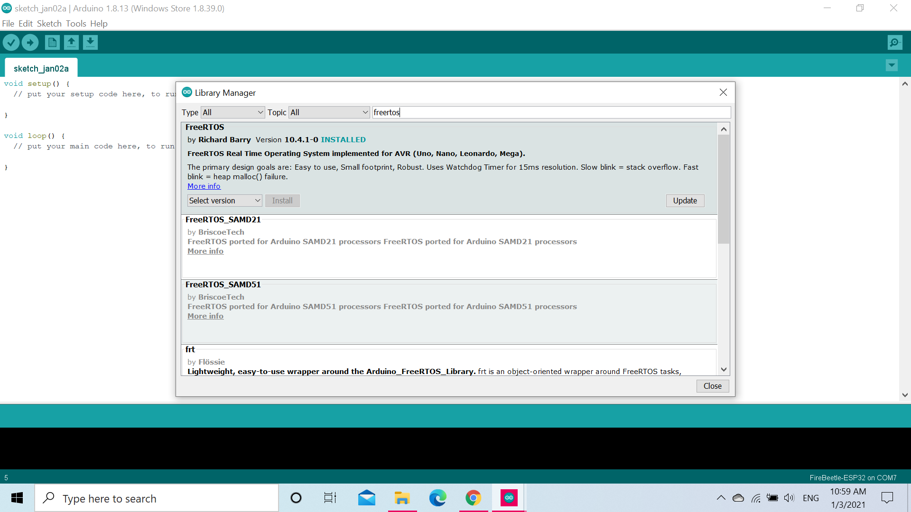
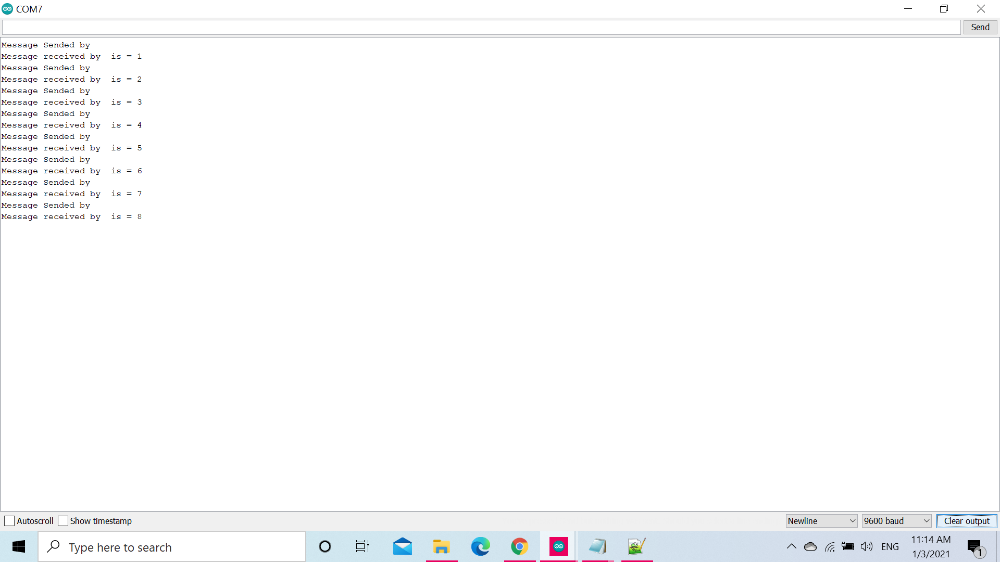
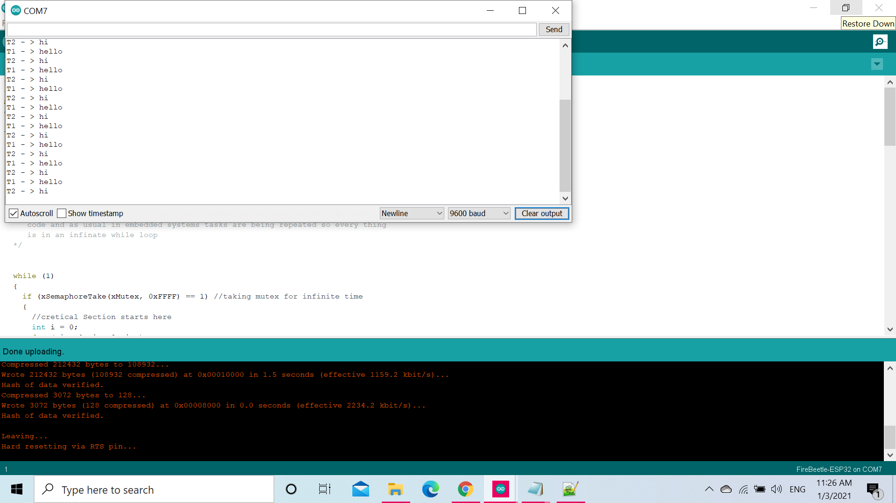
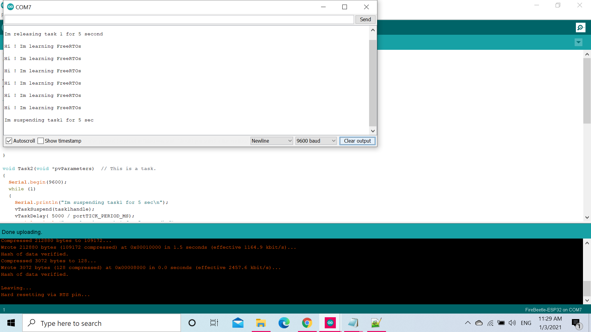

# FreeRTOS_ESP32
# Author :- Amit Kumar

This repository contains tutorials of FreeRTOS. The case study for them is ESP32. 
The reason for using ESP32 was their popularity. All the codes were tested on ESP32.

Following is a guide for setting-up FreeRTOS on Arduino IDE.

# IDE installation
Download and Install Arduino IDE from following link for your system

https://www.arduino.cc/en/main/software

# Installing Libraries
Navigate to Sketch -> Include Library -> Manage Libraries
Type in RTOS and Install the FreeRTOS library by Richard Barry

Here is a screenshot of the Library Manager 

# Compiling and Uploading Program
Copy any of the codes to Arduino IDE. Connect your Arduino to computer. 

Select the board by Tools -> Boards
Select the port to which your Arduino is connected by Tools -> Ports

# Repository Structure
Following are the details of the structure of this repository
Here is a screenshot of the hello 

Here is a screenshot of the Queue

Here is a screenshot of the Mutexuse

Here is a screenshot of the Task_suspend_resume

#  THANK YOU

